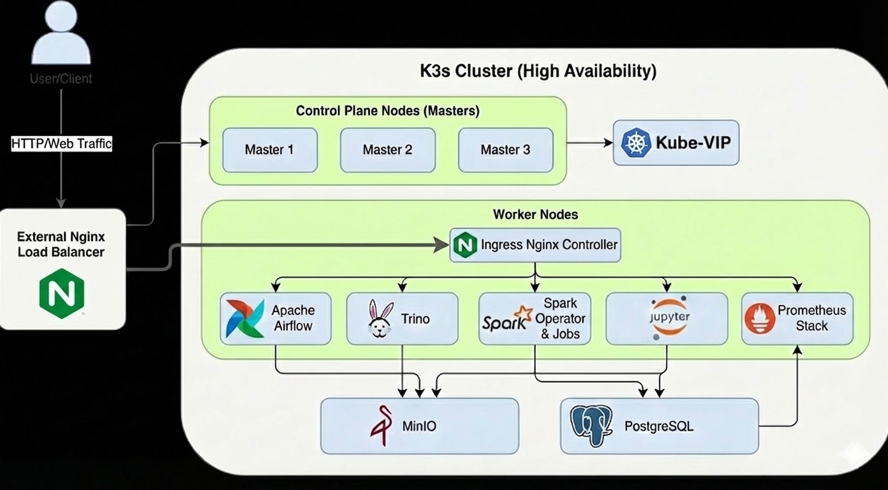

# Data Platform on Kubernetes (K3s)



## Overview

This project implements a production-grade, high-availability data platform on a **K3s Kubernetes cluster**. It is designed to be scalable and modular, integrating best-in-class open-source tools for data engineering, analytics, and machine learning.

**Key Components:**
*   **Orchestration:** Apache Airflow
*   **Compute:** Apache Spark (with GPU support), Trino (Distributed SQL)
*   **Storage:** MinIO (S3 Compatible), Apache Iceberg (Table Format)
*   **Metadata:** PostgreSQL, Iceberg REST Catalog
*   **Development:** JupyterLab (via Sparglim)
*   **Monitoring:** Prometheus Stack (Grafana, Alertmanager)
*   **Infrastructure:** HA Control Plane (Kube-VIP/Keepalived), Nginx Load Balancing

## Infrastructure Architecture

The cluster is deployed on a Proxmox/LXC environment (adaptable to VMs/Bare metal) with High Availability (HA) for the control plane.

### Network Topology

| Role | IP Address | Hostname | Description |
|------|------------|----------|-------------|
| **Control Plane VIP** | `192.168.1.254` | `k3s-cluster` | Virtual IP for API Server |
| **Load Balancer** | `192.168.1.100` | `lb-lxc` | External Nginx LB for Ingress |
| **Master Node 1** | `192.168.1.101` | `k3s-master-1` | Initial Control Plane Node |
| **Master Node 2** | `192.168.1.102` | `k3s-master-2` | HA Control Plane Node |
| **Master Node 3** | `192.168.1.103` | `k3s-master-3` | HA Control Plane Node |
| **Worker Node 1** | `192.168.1.104` | `k3s-worker-1` | Workload Node |
| **Worker Node 2** | `192.168.1.105` | `k3s-worker-2` | Workload Node |
| **Worker Node 3** | `192.168.1.106` | `k3s-worker-3` | Workload Node |
| **GPU Node** | *Dynamic* | `wsl-gpu` | Optional GPU Node (e.g., WSL2) |

---

## Installation Guide

### 1. Prerequisites
*   **Kernel Modules:** Ensure `overlay` and `br_netfilter` are loaded on all nodes.
    ```bash
    modprobe overlay
    modprobe br_netfilter
    # Add to /etc/modules-load.d/k3s.conf for persistence
    ```
*   **Sysctl:** Enable IP forwarding (`net.ipv4.ip_forward=1`).

### 2. High Availability Control Plane
We use **Keepalived** or **Kube-VIP** to manage the Virtual IP (`192.168.1.254`).

**On the Load Balancer / Master Nodes:**
Configure `keepalived` to broadcast the VIP.
```bash
sudo apt install keepalived
# Edit /etc/keepalived/keepalived.conf
sudo systemctl enable --now keepalived
```

### 3. K3s Cluster Setup

**Step 1: Initialize First Master**
```bash
curl -sfL https://get.k3s.io | K3S_TOKEN=k3scluster sh -s - server \
    --cluster-init \
    --disable=traefik \
    --disable=servicelb \
    --tls-san=192.168.1.254
```

**Step 2: Join Additional Masters**
```bash
curl -sfL https://get.k3s.io | K3S_TOKEN=k3scluster sh -s - server \
    --server https://192.168.1.254:6443 \
    --cluster-init \
    --disable=traefik \
    --disable=servicelb \
    --tls-san 192.168.1.254
```

**Step 3: Join Worker Nodes**
```bash
curl -sfL https://get.k3s.io | K3S_TOKEN=k3scluster sh -s - agent \
    --server https://192.168.1.254:6443
```

**Step 4: Configure Kubeconfig**
Copy `/etc/rancher/k3s/k3s.yaml` to your local machine's `~/.kube/config` and replace `127.0.0.1` with `192.168.1.254`.

### 4. Core Services (Helm)

**Ingress Controller (Nginx)**
```bash
helm repo add ingress-nginx https://kubernetes.github.io/ingress-nginx
helm upgrade --install ingress-nginx ingress-nginx/ingress-nginx \
  --namespace ingress-nginx --create-namespace \
  --set controller.service.type=NodePort \
  --set controller.service.nodePorts.http=30080 \
  --set controller.service.nodePorts.https=30443
```

**External Load Balancer (Nginx)**
Configure your external LB (`192.168.1.100`) to upstream to the worker nodes on port `30080`.

**Storage & Metadata**
*   **MinIO:** S3-compatible storage for Data Lake.
*   **PostgreSQL:** Metastore for Airflow and Iceberg.
*   **Iceberg:** REST Catalog for table management.

```bash
# Example deployments
kubectl apply -f minio/minio-init-job.yaml
helm upgrade --install postgres bitnami/postgresql -n catalog -f postgres/postgres-values.yaml
kubectl apply -f minio/iceberg/iceberg.yaml
```

### 5. Data Platform Components

**Trino (SQL Query Engine)**
Distributed SQL engine for querying data in MinIO/Iceberg.
```bash
helm repo add trino https://trinodb.github.io/charts/
helm upgrade --install trino trino/trino -n trino -f trino/trino-values.yaml
```

**Spark Operator & GPU Support**
Running Spark jobs on Kubernetes with optional NVIDIA GPU acceleration.
1.  **NVIDIA Device Plugin:** Install on GPU nodes.
    ```bash
    kubectl apply -f nvidia/nvidia-device-plugin.yaml
    ```
2.  **Spark Operator:**
    ```bash
    helm repo add spark-operator https://kubeflow.github.io/spark-operator
    helm upgrade --install spark-operator spark-operator/spark-operator -n spark --create-namespace
    ```

**Airflow (Workflow Orchestration)**
```bash
helm repo add airflow https://airflow.apache.org/
helm upgrade --install airflow airflow/airflow -n airflow -f airflow/deployment/airflow-values.yaml
```

**Sparglim & Jupyter**
Custom JupyterLab images with Spark Connect integration for development.
```bash
kubectl apply -f spark-connect/deployment/jupyter-sparglim-on-k8s
```

### 6. Monitoring
Full observability stack using Prometheus and Grafana.
```bash
helm repo add prometheus-community https://prometheus-community.github.io/helm-charts
helm install prometheus prometheus-community/kube-prometheus-stack -n monitoring -f prometheus/prometheus-values.yaml
```

---

## Accessing Services

Add the following to your `/etc/hosts` (or Windows hosts file), pointing to your External LB IP (`192.168.1.100`):

```text
192.168.1.100   minio.homelab minio-api.homelab iceberg.homelab trino.homelab
192.168.1.100   airflow.homelab grafana.homelab jupyter.homelab
```

| Service | URL |
|---------|-----|
| MinIO Console | `http://minio.homelab` |
| Trino UI | `http://trino.homelab` |
| Airflow | `http://airflow.homelab` |
| Grafana | `http://grafana.homelab` |
| Jupyter | `http://jupyter.homelab` |
